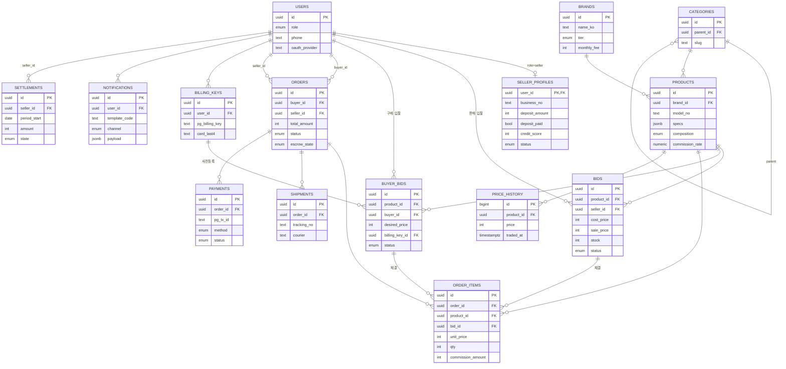

# TOOLBOX ERD (15 tables)

> 마이그레이션 SQL: `packages/db/supabase/migrations/0001_init_schema.sql`

## 핵심 제약/인덱스

- `bids (product_id, seller_id) UNIQUE` — 같은 상품에 같은 판매자는 1행만.
- `bids (product_id, sale_price) WHERE active AND stock>0` 부분 인덱스 — 최저가 5개 조회용.
- `buyer_bids (product_id, desired_price DESC) WHERE open` — 판매자가 본인 상품의 구매 입찰을 가격순으로.
- `products (brand_id, model_no, composition) UNIQUE` — 같은 모델·구성 중복 등록 방지.
- `payments.pg_tx_id UNIQUE` — 토스페이먼츠 거래 멱등.
- `shipments (courier, tracking_no) UNIQUE` — 운송장 중복 방지.

## 마스킹

- 구매자 노출용 view `bids_public`: `seller_id`, `cost_price`, `shipping_cost` 숨김.
- `seller_profiles.bank_account` 등은 RLS로 본인+admin만.
